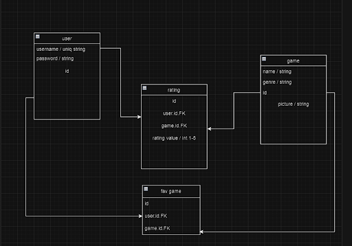
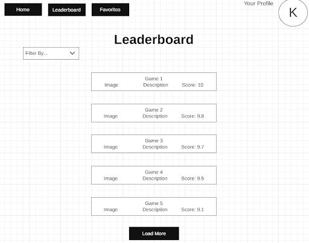

## Come check out a list of top rated games and see what people have to say about them.

Routes: Home page, Leaderboard, Favorites
Relarionships
User to Rating: One-to-Many relationship. One user can have many ratings, but each rating can only be associated with one user. This is represented by the user_id in the Rating table.

Game to Rating: One-to-Many relationship. One game can have many ratings, but each rating can only be associated with one game. This is represented by the game_id in the Rating table.

User to Favorite: Many-to-Many relationship. Many Users can have many favorite games. This is represented in the Favorites table, with user_id and game.id.

## User Stories:

-Rate games
-view highest rated gamesAdd new games
-Look through a list of games
-Sign up and log in
-Favorite your games

## Stretch Goals:

-Being able to add a profile picture
-Star rating system

## landing pages

Home

Leaderboard

Favorites

